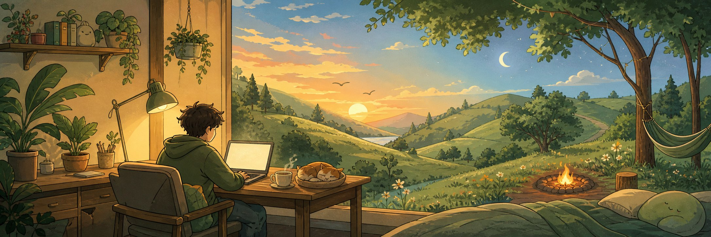

  

<h1 align="center">Hey, I'm Mohith.</h1>

  I build useful tools, playful interfaces, and whatever idea refuses to leave me alone.

  <a href="https://smohith.vercel.app/">Website</a> &middot;
  <a href="https://dev.to/mohith">Writing</a> &middot;
  <a href="https://github.com/MokiMeow?tab=repositories">All projects</a>

Coding is my favorite kind of fun. Sometimes it becomes a serious developer tool; sometimes it becomes a 3D scene, a tiny visualizer, or a rabbit hole I followed much too far.

I mostly bounce between **TypeScript, Python, React, and Next.js**. The tools change; making things does not. Away from the screen, I like green places, quiet time, and getting enough sleep.

### A few things I've made

- [**OARS**](https://github.com/MokiMeow/OARS) keeps important actions behind rules and approvals, then leaves a receipt.
- [**AURORA**](https://github.com/MokiMeow/AURORA) is my local-first workshop for planning, evaluating, and automating engineering work.
- [**GEMUI**](https://github.com/MokiMeow/GEMUI) is a playground for generating, comparing, editing, and exporting interface ideas.
- [**PatchPilot**](https://github.com/MokiMeow/PatchPilot) sorts through dependency noise, finds the vulnerabilities that matter, and keeps a human on the final button.

Also wandering around: [maze-find](https://github.com/MokiMeow/maze-find), [femmelytics-harmony](https://github.com/MokiMeow/femmelytics-harmony), and a [3D gallery](https://github.com/MokiMeow/card-gallery-).

  If something here makes you curious, open it up and have fun.

